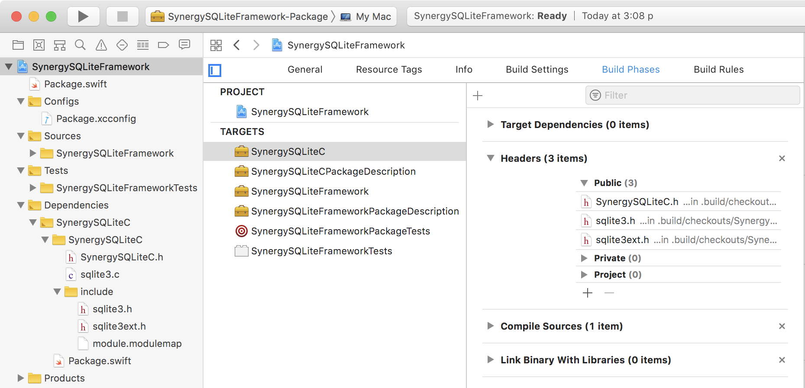

# SynergySQLiteFramework

<a id="toc"></a>
[API Summary](#ApiSummary) •
[Example](#Example) •
[Notes](#Notes) •
[Subproject Usage](#SubprojectUsage) •
[Original Setup](#OriginalSetup) •
[Resources](#Resources)

## API Summary <a id="ApiSummary">[▴](#toc)</a>

#### SynergySQLite (Utilities)

``` swift
static func escapeLikeString(_ s: String, escapeChar: String) -> String 
static func getProcessInfo() -> [String:String]
static func getSqliteInfo() -> [String:String]
```

#### SynergySQLiteDatabase -- database connection

``` swift
SynergySQLiteDatabase(pathname: String, options: OptionDictionary = [:])

func open()   -> Bool   // true: successful open
func close()  -> Bool   // true: successful open

func isOpen()    -> Bool
func getStatus() -> SynergySQLiteStatus
func hasError()  -> Bool

func importSql(filepath: String)
```

#### SynergySQLiteQuery

Use `SynergySQLiteQuery` manipulating and executing SQL statements.

_Note: only the first statement will be executed.  Separate multiple statements into multiple SynergySQLiteQuery. ... or :NYI: set up a bind parameter._

``` swift
SynergySQLiteQuery(db: SynergySQLiteDatabase) 
func statementPrepare(_ sql: String) -> Int // returns Int status
func statementReset()
func statementBind(paramIndex: Int32, paramValue: String) -> Int32
func statementExecute() // creates SynergySQLiteResult()

func getResult() -> SynergySQLiteResult?

func getStatus() -> SynergySQLiteStatus
func hasError()  -> Bool

// executes non-empty query
SynergySQLiteQuery(sql: String, db: SynergySQLiteDatabase)

// :NYI:   
// .bindValue(placeholder, value, type) 
// .bindValue(position, value, type)
// .boundValue(placeholder) 
// .boundValue(position)

```

#### SynergySQLiteResult

Created by `SynergySQLiteQuery` execution. `SynergySQLiteResult` is used for reading and formatting results. 

``` swift
public var columnNames: [String]
// :NYI: columnType: [SynergySQLiteResultTypes]
// :???: ponder column type in Query for mapping int to boolean
public var data: [[Any?]]

func toStringTsv(withColumnNames: Bool = true) -> String
// :NYI: toStringJson(withColumnNames: Bool = true)

func getRowData(rowIdx: Int) -> [Any?]
```

#### SynergySQLiteStatus

`SynergySQLiteStatus` provides status and error information.

## Example <a id="Example">[▴](#toc)</a>

``` swift
("select * from employees");
columnCount() // column fields 
columnIndex("name"); // index of column field "name"
columnType("name"), columnType(index)
rowCount() // rows
```

## Notes <a id="Notes">[▴](#toc)</a>

Boolean values are inserted and returned as `0` or `1`.

In Xcode the C header files need to be manually added to the project.



## Subproject Usage <a id="SubprojectUsage">[▴](#toc)</a>

1. Clone Repository

    ``` bash
    cd WORKING_DIRECTORY
    git clone git@github.com:VaporExamplesLab/SynergySQLiteFramework.git
    ```

2. Create Xcode project

    ``` bash
    cd SynergySQLiteFramework

    # for macOS
    swift package generate-xcodeproj --xcconfig-overrides Package.xcconfig
    ```

3. Verify `DEFINES_MODULE = YES` in Project Editor > Target > Build Settings.

4. Drag and drop SynergySQLiteFramework.xcodeproj as subproject to the parent Xcode project.

5. In the parent Xcode project, Project Editor > Target > Build Phases:
    * `+` add to Target Dependencies
    * `+` add to Link Binary With Libraries

## Original Setup <a id="OriginalSetup">[▴](#toc)</a>

_Steps taken to initial setup this project._

``` bash
mkdir SynergySQLiteFramework
cd SynergySQLiteFramework
swift package init
git init
git add README.md
git commit -m "first commit"
git remote add origin git@github.com-*:VaporExamplesLab/SynergySQLiteFramework.git
git push -u origin master

# swift build -Xswiftc "-target" -Xswiftc "x86_64-apple-macosx10.13"
swiftbuild # alias

# swift test -Xswiftc "-target" -Xswiftc "x86_64-apple-macosx10.13"
swifttest # alias

# swift package generate-xcodeproj --xcconfig-overrides Configs/Package.xcconfig
swiftxcode # alias
open SynergySQLiteFramework.xcodeproj
```

## Resources <a id="Resources">[▴](#toc)</a>

[SQLite: SQL As Understood By SQLite ⇗](https://www.sqlite.org/lang.html)  
[SQLite: Core Functions ⇗](https://www.sqlite.org/lang_corefunc.html)  
[SQLite: PRAGMA Statements ⇗](https://www.sqlite.org/pragma.html) … SQL extension specific to SQLite. Used to modify the operation of the SQLite library or to query the SQLite library for internal (non-table) data.  
